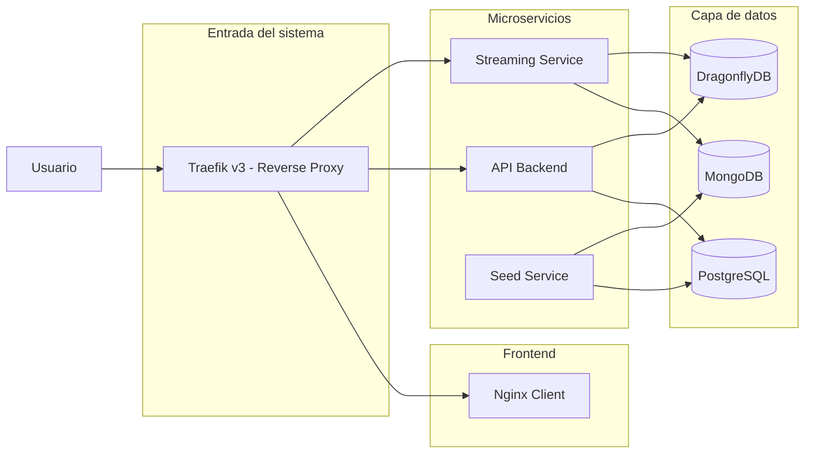

# Crescendo

## Descripción general

Crescendo es un servicio de streaming de música que permite a los usuarios reproducir, buscar y gestionar contenido musical de forma sencilla y eficiente.

---

## Funcionalidades

- Reproducción de canciones en streaming
- Búsqueda de canciones, álbumes y artistas
- Gestión básica de contenido musical

---

## Tecnologías utilizadas

- **Base de datos relacional:** PostgreSQL
- **Base de datos NoSQL:** MongoDB
- **Cache:** DragonflyDB
- **Proxy reverso / API Gateway:** Traefik v3
- **Contenerización:** Docker + Docker Compose
- **Servidor web cliente:** Nginx

---

## Arquitectura

Crescendo está basado en una arquitectura orientada a servicios compuesta por:

- **Traefik:** punto de entrada del sistema (routing, TLS, balanceo, rate limiting)
- **API Backend:** lógica de negocio principal (PostgreSQL + cache)
- **Streaming Service:** servicio especializado en entrega de audio (MongoDB + cache)
- **PostgreSQL:** almacenamiento estructurado principal
- **MongoDB:** almacenamiento de datos de catálogo/streaming
- **DragonflyDB:** cache distribuido de alto rendimiento
- **Seed service:** inicialización de datos del sistema
- **Client:** frontend servido mediante Nginx

---

## Diagrama de arquitectura



---

## Puesta en marcha

### Requisitos previos

- Docker
- Docker Compose

---

## Configuración de entorno

Antes de iniciar el sistema:

1. Ir a la carpeta `docker`

2. Copiar el archivo de ejemplo:

```bash
cp .env.example .env
```

3. Editar `.env` y configurar credenciales necesarias:
   - PostgreSQL
   - MongoDB
   - Cache
   - JWT

---

## Ejecución del proyecto

1. Clonar el repositorio:

```bash
git clone <repo-url>
cd crescendo
```

2. Levantar los servicios:

```bash
cd docker
docker compose up -d
```

3. Verificar estado de contenedores:

```bash
docker compose ps
```

4. Detener servicios:

```bash
docker compose down
```

---

## Servicios expuestos

- Cliente: http://crescendo.localhost
- API: http://api.crescendo.localhost
- Streaming: http://streaming.crescendo.localhost

---

## Construcción de imágenes

### API

```bash
cd server/api
docker build -t crescendo-api:1.0.0 .
```

---

### Streaming

```bash
cd server/streaming
docker build -t crescendo-streaming:1.0.0 .
```

---

## Seed de datos

El sistema incluye un servicio automático de inicialización:

- Inserta datos iniciales en PostgreSQL y MongoDB
- Se ejecuta una sola vez al levantar el stack

---

## Licencia

GNU GPL v3.0  
https://www.gnu.org/licenses/

---

## Equipo

- Ignacio Bianchi
- Gianluca Pluchino
- Valentina Huar Lopez
- Lautaro Rebeco